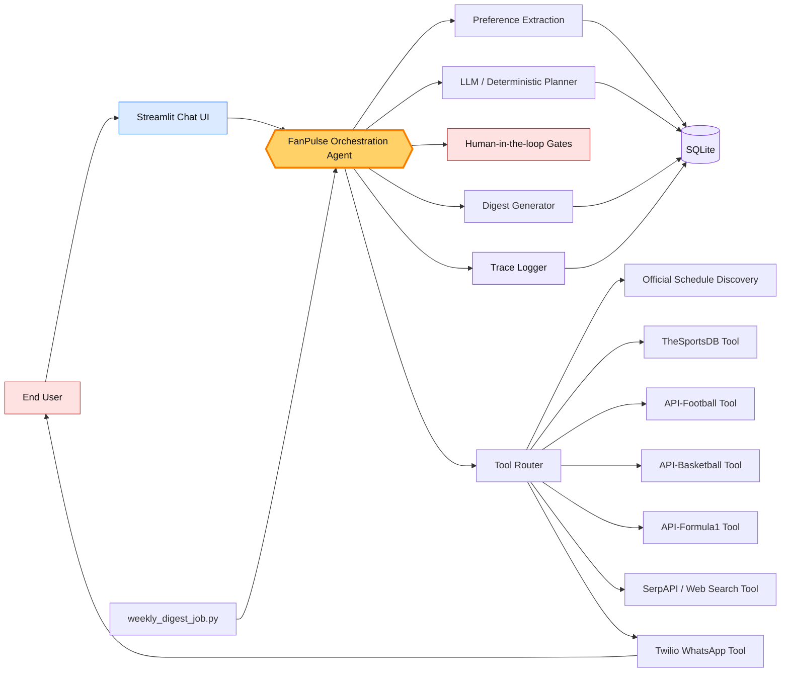

# FanPulse AI — Project Documentation

## 1. Executive Summary

FanPulse AI is a mock-first, chat-first sports digest agent. A fan tells the app which teams, athletes, sports, and leagues they follow. The system extracts the user's preferences, resolves ambiguity, creates a weekly digest preview, and approval-gates the WhatsApp send step.

The project is designed for an Agentic AI course assignment. It demonstrates a single orchestration agent that plans next actions, selects tools, maintains state, recovers from failures, and hands off to a human before sending messages.

Live app: https://fanpulseagent.streamlit.app/

GitHub repo: https://github.com/mnsrhz/FanPulse_Agent

---

## 2. What the App Does

FanPulse AI supports the following end-to-end journey:

1. User onboards through a chat-first Streamlit interface.
2. User provides name, teams, athletes, sports, digest schedule, timezone, and WhatsApp number.
3. Agent extracts structured preferences from the free-text message.
4. Agent identifies ambiguous preferences and asks for clarification.
5. User confirms preferences before they are saved.
6. Agent creates a tool plan for sports-event discovery.
7. Agent calls official schedule tools and sports-provider fallback tools.
8. Agent ranks upcoming events and generates a digest preview.
9. User approves the digest before it is sent.
10. App logs the agent trace, tool runs, digest history, and user preferences to SQLite.
11. Weekly job can run the same digest generation flow for enrolled users.

---

## 3. Key Product Capabilities

| Capability | Description |
|---|---|
| Conversational onboarding | User can describe preferences in natural language instead of using a long form. |
| Preference extraction | App extracts name, phone number, timezone, sports, teams, athletes, leagues, and schedule. |
| Ambiguity handling | Agent pauses when the user input is unclear, such as India Cricket. |
| Tool orchestration | Agent plans which lookup tools to call based on entity type and available data. |
| Mock-first execution | App runs without provider API keys using deterministic mock tool results. |
| Human-in-the-loop | User confirms preferences and approves digest before WhatsApp send. |
| Persistent state | SQLite stores profiles, digest history, tool runs, and traces. |
| Debug trace | Instructor can inspect planning, tool calls, fallback logic, and state transitions. |
| Weekly execution | Separate job runs recurring digest generation for enrolled users. |

---

## 4. Architecture Overview



### Architecture Notes

- **Streamlit UI** handles chat, preference confirmation, digest preview, approval buttons, and hidden debug trace.
- **FanPulse Orchestration Agent** is the central decision-making layer. It decides the next safe action, plans tool calls, handles failures, and pauses for human approval.
- **Tool Router** invokes mock-first or live tools for schedule discovery, sports APIs, search, ranking, digest generation, and WhatsApp delivery.
- **SQLite** stores durable state for preferences, digest history, tool runs, and agent trace logs.
- **Weekly Digest Job** reuses the same agent flow outside the UI for scheduled execution.

---

## 5. Agent Workflow with Edges

```mermaid
flowchart TD
    start([User sends onboarding message]) --> extract[Extract profile and sports entities]
    extract --> trace1[Log: plan_onboarding]
    trace1 --> missing{Missing required profile details?}

    missing -- Yes --> ask_profile[Ask for name / timezone / frequency]
    ask_profile --> start

    missing -- No --> ambiguous{Ambiguous entity?}
    ambiguous -- Yes --> clarify[Ask focused clarification]
    clarify --> resolve[Store clarification]
    resolve --> confirm[Ask user to confirm preferences]

    ambiguous -- No --> confirm[Ask user to confirm preferences]
    confirm --> approved_prefs{Preferences confirmed?}

    approved_prefs -- No --> start
    approved_prefs -- Yes --> save_state[Save preferences to SQLite]
    save_state --> plan_tools{{Orchestration Agent plans tool calls}}

    plan_tools --> official[Try official schedule discovery]
    official --> official_ok{Official events found?}

    official_ok -- Yes --> validate[Validate official events]
    official_ok -- No --> provider[Select provider fallback]

    provider --> soccer{Soccer?}
    soccer -- Yes --> apifootball[API-Football lookup]
    soccer -- No --> basketball{Basketball?}
    basketball -- Yes --> apibasketball[API-Basketball lookup]
    basketball -- No --> f1{Formula 1?}
    f1 -- Yes --> apiformula1[API-Formula1 lookup]
    f1 -- No --> sportsdb[TheSportsDB lookup]

    apifootball --> fallback_check{Events found?}
    apibasketball --> fallback_check
    apiformula1 --> fallback_check
    sportsdb --> fallback_check

    fallback_check -- No --> web[SerpAPI / Web search fallback]
    fallback_check -- Yes --> validate
    web --> validate

    validate --> upcoming[Filter future events]
    upcoming --> rank[Rank and deduplicate events]
    rank --> generate[Generate digest preview]
    generate --> approve_digest{Human approves digest?}

    approve_digest -- No --> edit[Ask for digest changes]
    edit --> generate

    approve_digest -- Yes --> contact_ready{WhatsApp consent and phone present?}
    contact_ready -- No --> ask_contact[Ask for phone and consent]
    ask_contact --> approve_digest

    contact_ready -- Yes --> send[Send or mock WhatsApp]
    send --> save_digest[Save digest history]
    save_digest --> complete([Complete])

    classDef agent fill:#ffd166,stroke:#f77f00,color:#111,stroke-width:3px;
    classDef decision fill:#fef3c7,stroke:#d97706,color:#111;
    classDef tool fill:#dcfce7,stroke:#16a34a,color:#111;
    classDef state fill:#ede9fe,stroke:#7c3aed,color:#111;
    classDef human fill:#fee2e2,stroke:#dc2626,color:#111;

    class plan_tools agent;
    class missing,ambiguous,approved_prefs,official_ok,soccer,basketball,f1,fallback_check,approve_digest,contact_ready decision;
    class official,apifootball,apibasketball,apiformula1,sportsdb,web,validate,rank,generate,send tool;
    class save_state,save_digest,trace1 state;
    class start,ask_profile,clarify,confirm,edit,ask_contact human;
```



---

## 6. Core Agent States

| State | Trigger | Next Action |
|---|---|---|
| `collect_profile_details` | Missing name, timezone, or schedule | Ask user for missing profile details. |
| `collect_preferences` | No teams, athletes, leagues, or sports found | Ask user what to track. |
| `clarify_ambiguity` | Ambiguous entity found | Ask focused clarification question. |
| `confirm_preferences` | Profile is complete and unambiguous | Ask user to confirm preferences before saving. |
| `approve_digest` | Digest exists but has not been approved | Ask user to approve before WhatsApp send. |
| `collect_contact` | Digest approval requested but phone/consent missing | Ask for WhatsApp number and consent. |
| `complete` | Digest was sent or mocked | End flow and preserve history. |

---

## 7. Tool Catalog

| Tool Name | Purpose | Source Type | Mock-first? |
|---|---|---|---|
| `fanpulse.normalize_sports_entity` | Normalize team, athlete, league, or sport names. | Internal tool | Yes |
| `official-schedule.discover_sources` | Find likely official schedule pages. | Search / official sources | Yes |
| `official-schedule.extract_events` | Extract events from source pages. | Official schedule pages | Yes |
| `official-schedule.validate_events` | Validate source-derived events. | Internal validation | Yes |
| `api-football.search_soccer_fixture` | Soccer fixture fallback. | API-Football | Yes |
| `api-basketball.search_team` | Basketball team lookup. | API-Sports Basketball | Yes |
| `api-formula1.search_driver` | F1 driver lookup. | API-Sports Formula 1 | Yes |
| `thesportsdb.search_team` | General team lookup. | TheSportsDB | Yes |
| `thesportsdb.search_player` | Athlete lookup fallback. | TheSportsDB | Yes |
| `serpapi.search_sports_events` | Web search fallback for sports events. | SerpAPI | Yes |
| `web.search_event_source` | Generic web fallback. | Web/Search | Yes |
| `fanpulse.rank_events` | Rank and deduplicate events. | Internal tool | Yes |
| `fanpulse.generate_digest` | Produce digest preview. | Internal tool | Yes |
| `twilio.send_whatsapp_digest` | Send or mock WhatsApp digest. | Twilio WhatsApp | Yes |
| `sqlite.save_state` | Persist user preferences. | SQLite | N/A |
| `sqlite.save_digest_history` | Persist digest history. | SQLite | N/A |

---

## 8. Human-in-the-loop Design

FanPulse intentionally stops at key points instead of acting autonomously.

### HITL Gate 1: Clarification
The agent pauses when a sports preference is ambiguous.

Example:
> “Did you mean India men’s national cricket team, India women’s national cricket team, or Indian Premier League cricket?”

### HITL Gate 2: Preference Confirmation
The agent asks the user to confirm extracted preferences before saving state.

### HITL Gate 3: Digest Approval
The agent shows a digest preview and waits for the user to approve before sending.

### HITL Gate 4: Contact and Consent
WhatsApp delivery is blocked unless the user has provided a phone number and consent.

---

## 9. State Management

FanPulse stores state in SQLite. This is important because the agent must remember preferences and digest history across runs.

Stored data includes:

- User profile
- Favorite teams, athletes, leagues, and sports
- Clarification choices
- Digest schedule
- WhatsApp consent status
- Digest history
- Tool runs
- Agent trace events
- Weekly run idempotency keys

---

## 10. Error Recovery Strategy

FanPulse handles failures through layered fallback:

1. Prefer official schedule discovery.
2. If official schedule extraction fails, use sport-specific provider tools.
3. If provider tools fail, use SportsDB or web search fallback.
4. If no reliable future event is found, mark the entity unresolved.
5. Do not fabricate event details.
6. Save failure details to the agent trace.
7. Ask the user for review when the result is incomplete.

---

## 11. Weekly Digest Execution

The app includes a separate scheduled runner:

```bash
PYTHONPATH=src python weekly_digest_job.py
```

The weekly job:

1. Loads enrolled users from SQLite.
2. Checks whether the current weekly run has already been processed.
3. Runs the same FanPulse agent digest flow.
4. Saves digest history.
5. Sends or mocks WhatsApp delivery if the user has consented.
6. Logs failures as trace entries.

---

## 12. Demo Script

### Sample onboarding prompt

```text
I am Mansoor. I follow the Lakers, Real Madrid, India cricket, Novak Djokovic and Max Verstappen. Send my digest every Friday morning to +14155550123 on WhatsApp. Use Pacific time.
```

### Demo Steps

1. Open the Streamlit app.
2. Paste the sample onboarding prompt.
3. Show the extracted preferences.
4. Resolve the India Cricket clarification.
5. Confirm preferences.
6. Show the generated digest cards with source links.
7. Open the Agent Trace / Debug View.
8. Point out planning, tool selection, tool calls, and state writes.
9. Approve the digest.
10. Show mocked WhatsApp send.
11. Trigger the weekly digest job from the UI or CLI.

---

## 13. Assignment Rubric Mapping

| Assignment Requirement | Where FanPulse Demonstrates It |
|---|---|
| Agent planning | Planner selects next conversational action and digest tool plan. |
| Tool calls | Agent invokes official schedule, sports APIs, web/search, ranking, digest, SQLite, and WhatsApp tools. |
| State across steps | SQLite stores profile, digest history, tool runs, and traces. |
| Error recovery | Agent retries/falls back across official schedule, provider APIs, SportsDB, and web search. |
| Human handoff | User clarifies ambiguity, confirms preferences, and approves digest. |
| Real task | Personalized weekly sports digest for busy fans. |
| Recurring execution | `weekly_digest_job.py` runs scheduled digest generation. |
| Debug visibility | Agent Trace / Debug View exposes planning and tool execution. |

---

## 14. Recommended Next Improvements

1. Replace remaining mock event extraction with live official schedule page extraction.
2. Add Firecrawl as a controlled scraper for known official schedule pages.
3. Add richer source confidence scoring.
4. Add user-level priority settings for teams and athletes.
5. Add email delivery as a backup to WhatsApp.
6. Add a lightweight admin view for digest history and unresolved entities.
7. Add deployment documentation for Streamlit Cloud secrets.
